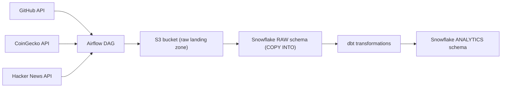
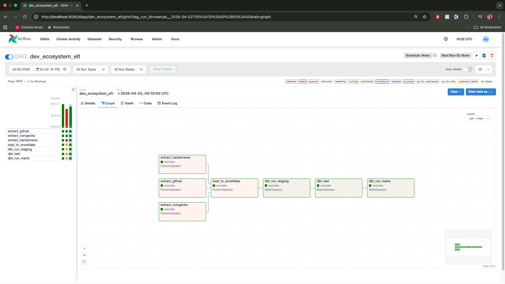
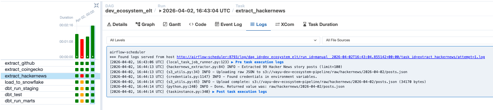
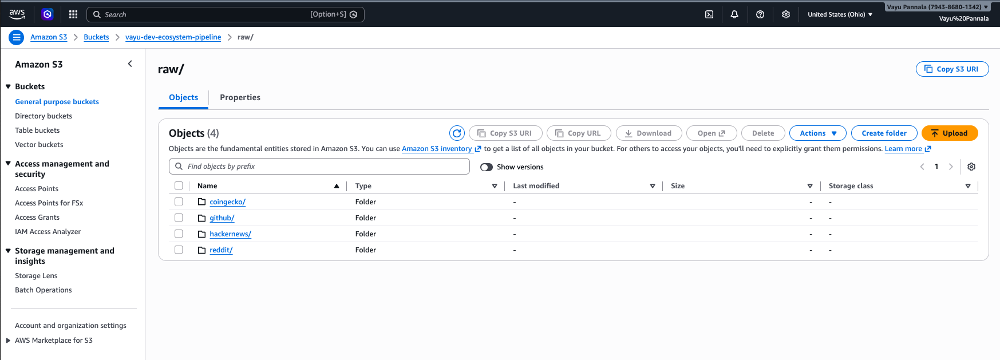
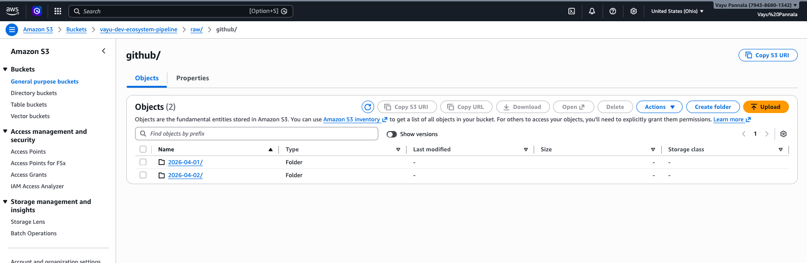
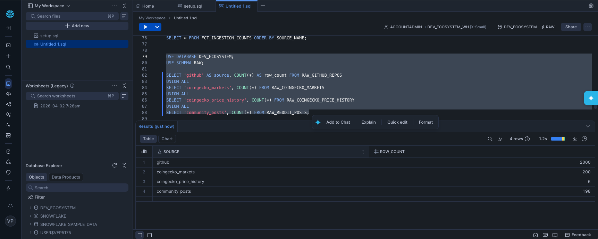
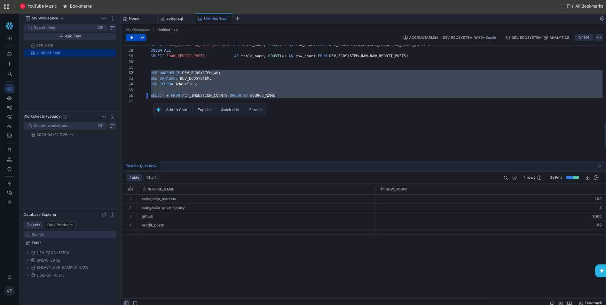

# dev-ecosystem-pipeline

End to end ELT pipeline that consolidates data from 3 live APIs (GitHub, CoinGecko, Hacker News) into Snowflake and transforms it with dbt.

## At A Glance

| Area | What this project does |
| --- | --- |
| Sources | GitHub, CoinGecko, and Hacker News live APIs |
| Pipeline | Airflow extracts -> S3 raw landing -> Snowflake `COPY INTO` -> dbt models |
| Cloud stack | Airflow, S3, Snowflake, dbt, Docker Compose |
| Data shape | Date-partitioned raw JSON with warehouse staging and analytics layers |
| Orchestration | Parallel API extraction with downstream load and transform steps |
| Warehouse | Snowflake RAW and ANALYTICS schemas |
| Modeling | dbt staging views plus mart-level ingestion analytics |
| Deployment style | Reproducible local environment via Docker Compose |

## What This Demonstrates 

- Orchestration with Airflow (parallel extracts -> load -> dbt)
- Data lake landing zone on S3 (date-partitioned raw JSON)
- Cloud warehouse ingestion with Snowflake `COPY INTO` from an external stage
- Modeling with dbt (staging views + mart table)
- Reproducible local environment via Docker Compose

## Architecture 

APIs -> S3 (raw landing zone) -> Snowflake (COPY INTO) -> dbt -> Analytics



1. Airflow extracts from APIs in parallel.
2. Each extractor uploads raw JSON to S3, partitioned by run date.
3. A load task uses Snowflake `COPY INTO` from an external S3 stage into the `RAW` schema.
4. dbt transforms raw data into staging and marts models.

## Data Lake Structure

```text
s3://<bucket>/
  raw/
    github/YYYY-MM-DD/repos.json
    coingecko/YYYY-MM-DD/markets.json
    coingecko/YYYY-MM-DD/price_history.json
    hackernews/YYYY-MM-DD/posts.json
```

## Environment Variables

All credentials are read from environment variables (no hardcoding).

- `GITHUB_TOKEN`
- `SNOWFLAKE_ACCOUNT`, `SNOWFLAKE_USER`, `SNOWFLAKE_PASSWORD`, `SNOWFLAKE_DATABASE`, `SNOWFLAKE_WAREHOUSE`
- `AWS_ACCESS_KEY_ID`, `AWS_SECRET_ACCESS_KEY`, `AWS_REGION`, `S3_BUCKET_NAME`

## Local Development

1. Create `.env` based on `.env.example` and fill in your values.
2. Create `dbt_project/profiles.yml` based on `dbt_project/profiles.yml.example` (uses env vars for auth).
3. Start Airflow with Docker Compose:

   ```bash
   docker compose up -d --build
   ```

4. Open Airflow UI at `http://localhost:8080` and log in with `airflow` / `airflow`.
5. Trigger DAG `dev_ecosystem_elt`.

## Verify Outputs

Snowflake (RAW counts):

```sql
select 'github' as source, count(*) from dev_ecosystem.raw.raw_github_repos
union all
select 'coingecko_markets', count(*) from dev_ecosystem.raw.raw_coingecko_markets
union all
select 'coingecko_price_history', count(*) from dev_ecosystem.raw.raw_coingecko_price_history
union all
select 'community_posts', count(*) from dev_ecosystem.raw.raw_reddit_posts;
```

Snowflake (mart table):

```sql
select * from dev_ecosystem.analytics.fct_ingestion_counts order by source_name;
```

## Run dbt Without Installing Locally

dbt is preinstalled in the Airflow container image for this repo, so you can run dbt via Docker:

```bash
docker compose exec airflow-webserver bash -lc "cd /opt/airflow/dbt_project && dbt debug"
docker compose exec airflow-webserver bash -lc "cd /opt/airflow/dbt_project && dbt run --select path:models/staging"
docker compose exec airflow-webserver bash -lc "cd /opt/airflow/dbt_project && dbt test"
docker compose exec airflow-webserver bash -lc "cd /opt/airflow/dbt_project && dbt run --select path:models/marts"
```

Note: if `dbt test` prints "Nothing to do", it means no tests are defined in this project yet.

## Notes

- Extractors log each S3 upload and the S3 key written.
- Snowflake loading uses `COPY INTO` with a JSON file format using `STRIP_OUTER_ARRAY = TRUE`.
- This project keeps the Snowflake table name `RAW.RAW_REDDIT_POSTS` and dbt model `stg_reddit_posts` for compatibility, but the source data is currently Hacker News posts (open API).

## Portfolio Assets

See `docs/SCREENSHOTS.md` for exactly what to capture and commit under `docs/screenshots/`.

Deep dive docs:

- `docs/PROJECT_WALKTHROUGH.md` (how everything connects)
- `docs/GLOSSARY.md` (definitions of key terms)
- `docs/INTERVIEW_PREP.md` (question bank + talking points)

## Screenshots

Airflow DAG (end-to-end run):



Airflow log proof (S3 upload):



S3 landing zone layout:



S3 date partitions (example source):



Snowflake RAW counts:



Sno analytics mart (dbt output):


